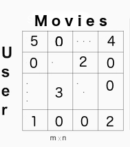
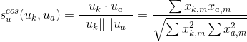
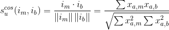
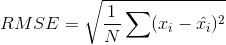

#Simple Collaborative Filtering Movie Recommender
Collaborative filtering (CF) recomenders make predictions based on the data of users’ attitude to items, wisdom of the crowd. One of the advantages of this type of recomender is that will not require content features of the movies to predcitons, the rating between users, movies, and other users is enough. 

#Data
MovieLens dataset 100k
http://grouplens.org/datasets/movielens/

The data comes as a series of ratings connected to a user ID. Although this works for storing the rating, it need to be in a User x Movies matrix as seen below.
# 

#Cosine Similarity (Memory-based CF)
Cosine Similarity is a distance metric commonly used in recommender systems where the ratings are seen as vectors in n-dimensional space and the similarity is calculated based on the angle between vectors. User-based can be calculated using the formula below for users a and m, where the dot product of the user vector Uk and the user vector Ua is divided by the multiplication of the Euclidean lengths of the vectors.
# 

To calculate similarity between movies (movie-based) m and b you use the formula:
# 

Root Mean Squared Error to evaluate:
# 
User-based:  ~3.129
Movie-based:  ~3.455

#SVD (Model-based CF)
Singular value decomposition (SVD) is a well-known matrix factorization method. Collaborative Filtering can be formulated by approximating a matrix X by using singular value decomposition.
The general equation can be expressed as follows:
# 

Sparsity level of MovieLens 100K Dataset is  0.937

It is important to remember that using relatively few known entries is likely cause overfitting issues. SVD can be very slow and computationally expensive.

User-based CF MSE:  ~2.721