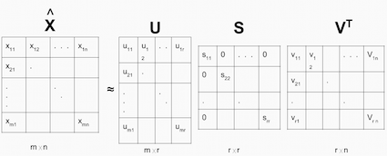

# Simple Collaborative Filtering Movie Recommender
Collaborative filtering (CF) recomenders make predictions based on the data of users’ attitude to items, wisdom of the crowd. One of the advantages of this type of recomender is that will not require content features of the movies to predcitons, the rating between users, movies, and other users is enough. 

#Data
MovieLens dataset 100k
http://grouplens.org/datasets/movielens/

The data comes as a series of ratings connected to a user ID. Although this works for storing the rating, it need to be in a User x Movies matrix as seen below.
# 

#Cosine Similarity (Memory-based CF)
Cosine Similarity is a distance metric commonly used in recommender systems where the ratings are seen as vectors in n-dimensional space and the similarity is calculated based on the angle between vectors. User-based can be calculated using the formula below for users a and m, where the dot product of the user vector Uk and the user vector Ua is divided by the multiplication of the Euclidean lengths of the vectors.
# 

To calculate similarity between movies (movie-based) m and b you use the formula:
# 

Root Mean Squared Error to evaluate:
# 
User-based:  3.12937725018
Movie-based:  3.455726081

#SVD (Model-based CF)
A well-known matrix factorization method is Singular value decomposition (SVD). Collaborative Filtering can be formulated by approximating a matrix X by using singular value decomposition. The winning team at the Netflix Prize competition used SVD matrix factorization models to produce product recommendations, for more information I recommend to read articles: Netflix Recommendations: Beyond the 5 stars and Netflix Prize and SVD.
The general equation can be expressed as follows:
# 

Carelessly addressing only the relatively few known entries is highly prone to overfitting. SVD can be very slow and computationally expensive. More recent work minimizes the squared error by applying alternating least square or stochastic gradient descent and uses regularization terms to prevent overfitting. You can see one of our previous [tutorials]((http://online.cambridgecoding.com/notebooks/eWReNYcAfB/implementing-logistic-regression-classifier-trained-by-gradient-descent-4) on stochastic gradient descent for more details. Alternating least square and stochastic gradient descent methods for CF will be covered in the next tutorials.